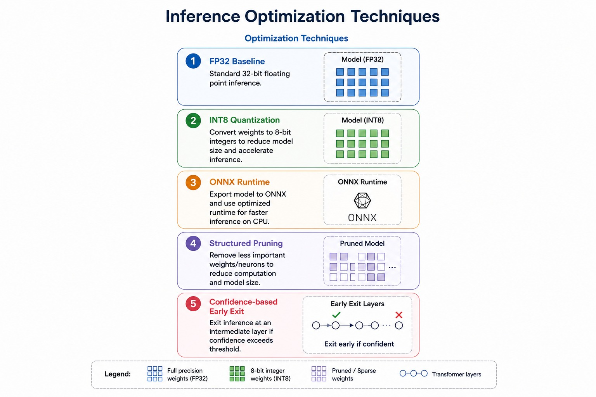

# Breathprint Edge
### LLM Inference Optimization for VOC Biomarker Classification on Raspberry Pi 5

**ELENE6908 — Embedded AI | Columbia University**
**Group 15 — Harissh Anbarasan Sudhamathi (ha2771) · Kevin Thomas (kt3054)**

---

## Overview

Breathprint Edge investigates how far transformer-based models can be optimized for real-time inference on a Raspberry Pi 5 — a constrained, low-power ARM device — while preserving classification accuracy for volatile organic compound (VOC) biomarker detection.

Human breath contains trace gases such as acetone (linked to diabetes), isoprene (cholesterol), and ethanol that act as non-invasive health indicators. We classify six VOC types from 16-channel metal oxide sensor readings using two transformer architectures, each benchmarked across five inference optimization techniques.

The central finding is a **5.85× latency speedup** over the FP32 baseline achieved by confidence-based early exit on DistilBERT, with only a 0% accuracy drop, confirming that transformer inference can be made practical on edge hardware without accuracy compromise.

---

## Repository Structure

```
ELENE6908_ha2771_kt3054_Group15/
│
├── README.md
│
├── bert/
│   ├── breathprint_distilbert_final.ipynb   # Training + 5-method benchmark (Colab)
│   └── weights/
│       ├── bert.py                          # Pi 5 inference script
│       ├── pi_fp32.pt                       # Stage 1: FP32 baseline weights
│       ├── pi_int8.pt                       # Stage 2: INT8 quantized weights
│       ├── pi_pruned.pt                     # Stage 4: Pruned model weights
│       ├── pi_ee.pt                         # Stage 5: Early exit model weights
│       ├── distilbert_sensor.onnx           # Stage 3: ONNX export
│       └── distilbert_sensor_best.pt        # Best training checkpoint
│
└── gpt/
    ├── breathprint_distilgpt_final.ipynb    # Training + 5-method benchmark (Colab)
    └── weights/
        ├── gpt.py                           # Pi 5 inference script
        ├── pi_fp32.pt                       # Stage 1: FP32 baseline weights
        ├── pi_int8.pt                       # Stage 2: INT8 quantized weights
        ├── pi_pruned.pt                     # Stage 4: Pruned model weights
        ├── pi_ee.pt                         # Stage 5: Early exit model weights
        └── distilgpt_sensor.onnx            # Stage 3: ONNX export
```

---

## Dataset

**UCI Gas Sensor Array Drift Dataset** (ID: 270)
- 13,910 samples · 128 features (16 MOX sensor channels × 8 time steps)
- 6 gas classes: Ethanol, Ethylene, Ammonia, Acetaldehyde, Acetone, Toluene
- Split: 70% train / 15% validation / 15% test (stratified, seed=42)
- Preprocessing: StandardScaler fitted on training set only

---

## Models

### DistilBERT Sensor Classifier (`bert/`)

A pretrained `distilbert-base-uncased` backbone (6 transformer layers, d_model=768, 12 attention heads, ~66M parameters) adapted for numerical sensor input via a learned input projector.

**Input adapter:** each scalar sensor reading is projected to a 768-dim token via `nn.Linear(1, 768)`. A learnable CLS token and positional embedding are prepended before the transformer stack. A lightweight exit head is attached after each of the 6 transformer layers for early exit inference.

**Training:** two-phase. Phase 1 (5 epochs) freezes the DistilBERT backbone and trains only the adapter and classification heads. Phase 2 (up to 15 epochs) fine-tunes all parameters with differential learning rates (backbone: 2e-5, heads: 1e-4) and co-trains exit heads with a weighted loss (60% final + 40% intermediate average).

**Achieved accuracy:** 98.95% on the test set.

### DistilGPT Sensor Classifier (`gpt/`)

A similar architecture built on a DistilGPT2 backbone, adapted with the same input projector and exit head design. Offers a comparison between an encoder-only (DistilBERT) and decoder-only (DistilGPT) backbone for sensor classification.

---

## Inference Optimization Techniques

Five optimization stages are applied to each model and benchmarked on both Colab CPU and Raspberry Pi 5.



### Stage 1 — FP32 Baseline
Standard 32-bit floating-point inference using PyTorch. No modifications applied. Serves as the reference point for all speedup calculations.

### Stage 2 — INT8 Dynamic Post-Training Quantization
All `nn.Linear` layer weights are compressed from float32 to int8 using `torch.quantization.quantize_dynamic`. Weights are stored at half the byte width (~2× smaller checkpoint), but are dequantized back to float32 at runtime before each matrix multiplication.

**Important limitation:** dynamic quantization does not perform true int8 arithmetic. It reduces storage but adds a dequantization step on top of the same float32 matmul, resulting in *higher* latency on both Colab and the Pi 5 for models where hidden dimensions are below ~1024. True speedup from INT8 requires static quantization with activation calibration (e.g., `torchao` with `Int8DynamicActivationInt8Weight`).

**Backend note:** `fbgemm` is used on x86 (Colab); `qnnpack` is used on ARM (Raspberry Pi 5). The scripts auto-detect architecture and set the backend accordingly.

### Stage 3 — ONNX Runtime
The model is exported to ONNX format (opset 18) using the legacy TorchScript exporter (`dynamo=False`). An ORT session is created with `ORT_ENABLE_ALL` graph optimisations, operator fusion, constant folding, and ARM NEON SIMD kernels on the Pi 5. The session is configured with 4 threads to match the Pi 5's quad-core Cortex-A76.

### Stage 4 — Structured Attention Head Pruning
4 of 12 attention heads per transformer layer are physically removed (33% reduction), selected by the combined Q+K+V+O L1 norm importance score — the heads contributing least to the model's representations are pruned first. Q/K/V/O weight matrices are physically resized from `768×768` to `768×512`, giving a genuine parameter and FLOP reduction (~6.9% fewer parameters overall). A 10-epoch fine-tune with `ReduceLROnPlateau` scheduling recovers accuracy after pruning.

This is distinct from unstructured weight masking: resizing the matrices means the reduction is visible to the matmul kernel, producing real latency improvement rather than just sparsity in a dense computation.

### Stage 5 — Confidence-Based Early Exit
A lightweight classifier head (LayerNorm → Linear(768, 256) → GELU → Linear(256, 6)) is attached after each of the 6 transformer layers. At inference time, the model checks the maximum softmax probability after each layer — if it exceeds a confidence threshold, inference stops and that layer's prediction is returned, skipping all subsequent transformer computation.

The threshold is calibrated on the validation set by maximising `early_exit_rate − 10 × accuracy_penalty`, balancing aggressiveness of early exit against accuracy retention. At threshold=0.80, **98.99% of test samples exit before the final layer**, with a mean exit layer of 0.27 — nearly all samples classified after the first transformer block.

---

## Results

### DistilBERT — Colab CPU Benchmark (50 runs, single-sample)

| Stage | Accuracy | Latency (ms) | Speedup vs FP32 | Disk Size |
|---|---|---|---|---|
| 1 — FP32 Baseline | 98.95% | 144.80 | 1.00× | 260 MB |
| 2 — INT8 PTQ | 96.17% | 88.87 | **1.63×** | 134 MB |
| 3 — ONNX Runtime | 98.95% | 193.27 | 0.75× | 165 MB |
| 4 — Struct. Pruning | 98.13% | 134.22 | 1.08× | 242 MB |
| 5 — Early Exit | 98.95% | 24.76 | **5.85×** | 260 MB |

**Key findings:**
- Early exit achieves a 5.85× speedup with zero accuracy loss — the strongest result across all five methods.
- INT8 shows a modest 1.63× speedup at the cost of 2.78pp accuracy; dynamic quantization is not lossless.
- ONNX Runtime is slower than FP32 on Colab CPU because x86 Xeon matmuls are already highly optimised — ORT's benefit is larger on ARM where the baseline is slower.
- Structured pruning gives a small speedup (1.08×) with only 0.82pp accuracy drop, confirming substantial redundancy in the 12-head attention stack.

---

## Results
Both transformer models were first trained and evaluated in Google Colab. The trained model files were then downloaded and loaded onto the Raspberry Pi 5, where the final edge-device benchmarks were performed. On the Raspberry Pi 5, each model was evaluated using single-sample CPU inference across five inference settings: FP32 baseline, INT8 quantization, ONNX Runtime, structured pruning, and confidence-based early exit.
### Raspberry Pi 5 Benchmark: DistilBERT and GPT-2

The models were benchmarked on Raspberry Pi 5 using single-sample CPU inference.  
Five inference settings were evaluated: FP32 baseline, INT8 quantization, ONNX Runtime, structured pruning, and confidence-based early exit.

---

### DistilBERT — Raspberry Pi 5 Benchmark

| Stage | Accuracy | Latency (ms) | Speedup vs FP32 | Energy |
|---|---:|---:|---:|---:|
| 1 — FP32 Baseline | 90% | 214.7 | 1.00× | 7 mWh |
| 2 — INT8 PTQ | 85% | 274.2 | 0.78× | 7 mWh |
| 3 — ONNX Runtime | 80% | 169.9 | 1.26× | 7 mWh |
| 4 — Structured Pruning | 85% | 218.4 | 0.98× | 7 mWh |
| 5 — Early Exit | 80% | 109.3 | **1.96×** | 7 mWh |

**Key findings:**
- Early exit achieved the fastest DistilBERT inference time at **109.3 ms**, giving a **1.96× speedup** over the FP32 baseline.
- The FP32 baseline achieved the highest DistilBERT accuracy at **90%**.
- Early exit reduced latency significantly, but accuracy dropped from **90% to 80%**, showing a trade-off between speed and classification performance.
- ONNX Runtime improved latency to **169.9 ms**, but also reduced accuracy to **80%**.
- INT8 quantization and structured pruning did not improve latency on Raspberry Pi 5 in this setup.
- Energy usage stayed constant at **7 mWh** across all DistilBERT variants.

---

### GPT-2 / DistilGPT-2 — Raspberry Pi 5 Benchmark

| Stage | Accuracy | Latency (ms) | Speedup vs FP32 | Energy |
|---|---:|---:|---:|---:|
| 1 — FP32 Baseline | 100% | 228.5 | 1.00× | 6 mWh |
| 2 — INT8 PTQ | 100% | 229.8 | 0.99× | 8 mWh |
| 3 — ONNX Runtime | 100% | 155.4 | 1.47× | 7 mWh |
| 4 — Structured Pruning | 100% | 237.8 | 0.96× | 8 mWh |
| 5 — Early Exit | 100% | 122.1 | **1.87×** | 9 mWh |

**Key findings:**
- GPT-2 maintained **100% accuracy across all inference variants**, making it more robust than DistilBERT in this experiment.
- Early exit achieved the best GPT-2 latency at **122.1 ms**, giving a **1.87× speedup** with no accuracy loss.
- ONNX Runtime also improved inference speed, reducing latency to **155.4 ms** with a **1.47× speedup**.
- INT8 quantization and structured pruning did not improve GPT-2 latency on Raspberry Pi 5.
- The FP32 GPT-2 baseline had the lowest measured energy usage at **6 mWh**, while early exit used **9 mWh**.
- Overall, GPT-2 with early exit provided the best accuracy-latency trade-off.

---

### Overall Findings

- **GPT-2 was the stronger overall model**, maintaining 100% accuracy across all optimization methods.
- **Early exit was the most effective latency-reduction method** for both models.
- DistilBERT achieved the highest speedup with early exit, but this came with a noticeable accuracy drop.
- GPT-2 early exit delivered a strong speedup while preserving full accuracy, making it the best balanced deployment option.
- ONNX Runtime was also effective, especially for GPT-2, where it improved latency without reducing accuracy.
- INT8 quantization and structured pruning did not consistently improve performance on Raspberry Pi 5, likely due to CPU execution overhead and hardware-specific runtime behavior.
- These results show that transformer-based VOC gas classification can run on low-power edge hardware, but the best optimization strategy depends strongly on model architecture and deployment conditions.


## Raspberry Pi 5 Deployment

### Hardware
- **SoC:** Raspberry Pi 5 (BCM2712)
- **CPU:** ARM Cortex-A76 × 4 cores @ 2.4 GHz
- **RAM:** 8 GB LPDDR4X
- **OS:** Raspberry Pi OS 64-bit (Debian Bookworm)

### Setup

```bash
# 1. Transfer files to Pi
scp bert/weights/*.pt bert/weights/*.onnx bert/weights/bert.py \
    pi@<PI_IP>:~/breathprint/bert/

scp gpt/weights/*.pt gpt/weights/*.onnx gpt/weights/gpt.py \
    pi@<PI_IP>:~/breathprint/gpt/

# 2. SSH and install dependencies
ssh pi@<PI_IP>
pip install torch transformers onnxruntime numpy scikit-learn pandas ucimlrepo

# 3. Run DistilBERT demo
cd ~/breathprint/bert
python bert.py

# 4. Run DistilGPT demo
cd ~/breathprint/gpt
python gpt.py
```

### What the inference scripts do

Each inference script (`bert.py`, `gpt.py`) loads all five model variants in sequence, runs 10 test samples through each, and prints per-sample predictions with true labels, latency, and exit layer (for early exit). A final summary table shows average latency, accuracy, and speedup vs FP32 across all five stages.

The INT8 backend is auto-detected: `qnnpack` is selected on ARM (Pi 5) and `fbgemm` on x86 (Colab/desktop). This is important because using the wrong backend (`fbgemm` on ARM) causes a `RuntimeError: unknown architecture` crash.

### Expected Pi 5 latency

Pi 5 absolute latency is approximately 5–10× higher than Colab CPU. Relative speedups between methods are preserved. Early exit is expected to show the most benefit on Pi because the cost of a full 6-layer transformer pass is higher in absolute terms, making layer-skipping more valuable.

---

## Software Stack

| Component | Version |
|---|---|
| Python | 3.11 / 3.12 |
| PyTorch | 2.10.0 |
| Transformers (HuggingFace) | 5.0.0 |
| ONNX Runtime | ≥ 1.17.0 |
| scikit-learn | ≥ 1.3.0 |
| Training hardware | Colab T4 GPU |
| Inference hardware | Raspberry Pi 5 (ARM Cortex-A76) |

---

## References

1. V. Sanh et al., "DistilBERT, a distilled version of BERT," arXiv:1910.01108, 2019.
2. E. Frantar et al., "GPTQ: Accurate post-training quantization for generative pre-trained transformers," arXiv:2210.17323, 2022.
3. A. Capotondi et al., "CMix-NN: Mixed low-precision CNN library for memory-constrained edge devices," IEEE TCAD, vol. 39, no. 10, 2020.
4. A. Vergara et al., "Chemical gas sensor drift compensation using classifier ensembles," Sensors and Actuators B, vol. 166–167, 2012.
5. J. Fonollosa et al., "Reservoir computing compensates slow response of chemosensor arrays," Sensors and Actuators B, vol. 215, 2015.
6. S. Teerapittayanon et al., "BranchyNet: Fast inference via early exiting from deep neural networks," ICPR 2016.
7. J. Xin et al., "DeeBERT: Dynamic early exiting for accelerating BERT inference," ACL 2020.

---

*Columbia University · ELENE6908 Embedded AI · Spring 2026*
